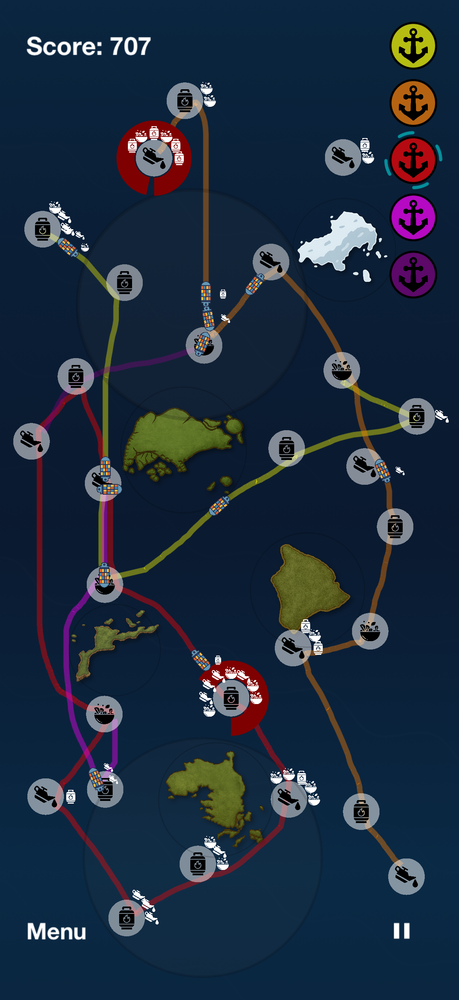
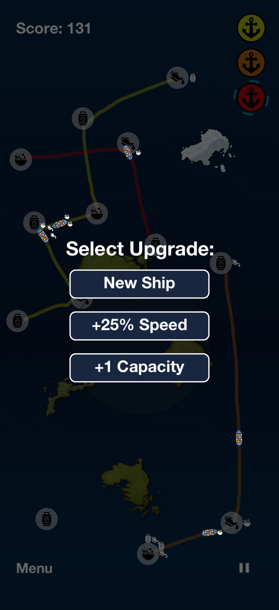

# Flowt: Offshore

**Flowt** is a fully–polished iOS strategy game built with a modern, modular Swift codebase.
It’s a paid App Store title that demonstrates real production engineering: clean architecture, async data pipelines, automated testing, CI/CD, and a well‑designed, animation–driven UI.

> Live on the App Store: https://apps.apple.com/app/flowt-offshore/id6753603068
>
> Demo trailer: https://streamable.com/ctp2us

---

## Table of contents

- [Short description](#short-description)
- [Highlights & features](#highlights--features)
- [Architecture & design decisions](#architecture--design-decisions)
- [Tech stack](#tech-stack)
- [Project structure (high level)](#project-structure-high-level)
- [Running locally (quick start)](#running-locally-quick-start)
- [Running tests (unit / integration / UI)](#running-tests-unit--integration--ui)
- [CI / CD (Xcode Cloud)](#ci--cd-xcode-cloud)
- [Design & UX polish notes](#design--ux-polish-notes)
- [Contributing](#contributing)
- [License](#license)
- [Screenshots](#screenshots)
- [Contact](#contact)

---

## Short description

Flowt is a focused strategy puzzle game about building efficient sea routes. Connect offshore ports, balance supply and demand, and keep cargo moving under pressure. Ships automatically follow permanent routes you draw. The goal is simple: prevent port overloads and push your best score as high as you can.

The repository contains the full application: SwiftUI wrapper, SpriteKit game scene, services, view models, mocks, tests and CI configuration.

---

## Highlights & features

- End-to-end iOS app shipped to the App Store (paid app).
- Two UI paradigms used intentionally: **SwiftUI** (app wrapper, menus, profile, leaderboard, settings) + **SpriteKit** (performance-sensitive 2D game scene).
- Firebase Auth (email/password) + Sign in with Apple.
- Firestore global leaderboard with rank calculation and profile loading.
- Game Center achievements and integration.
- Mock services for offline development/testing.
- Dependency Injection and clear separation of concerns (services, view models, app state).
- Design/architecture patterns used: MVVM (SwiftUI views + ViewModels), Service layer, AppState, Singleton utilities (AudioService, GameCenterService), Factory pattern, Strategy pattern (ship movement), and more.
- Polished UI: subtle animations, parallax, vignette, haptics and sound design.
- Swift Concurrency used across service APIs, views and view models.
- NSFW detector: open source integration used to validate uploaded avatars in Profile flow.
- Full automated test coverage: Unit, Integration and UI tests (using mocks where appropriate); overall **coverage above 85%**.
- Xcode Cloud CI / CD configured: build, test (test plan), bump build number, archive and distribute to App Store Connect & TestFlight; internal + external tester notification.

---

## Architecture & design decisions

### App shell & navigation
The app uses a central `AppState` as the single source of truth for session and navigation state.
RootView switches between loading, authentication, email-verification and the main menu based on appState.currentScreen, keeping the navigation fully deterministic and side-effect free.
Inside the main application flow, tab selection is owned by the app shell, not by individual screens.
MainMenuView renders the selected tab, while AppState stores the active MainMenuTab and updates it through a simple callback (onTabChange).
This keeps the tab logic centralized, testable and independent of UI components.
A dedicated MainMenuContainer owns all view models and injects services (Firebase/Auth/Firestore/Game/Score/Profile), ensuring clean separation and predictable lifecycle.

### MVVM + Services
The UI layer (SwiftUI) remains intentionally thin: each screen is driven by a dedicated ViewModel (AuthViewModel, ProfileViewModel, GameViewModel, etc.), which exposes state and handles user intent.
All side effects and platform interactions live in dedicated service objects (AuthService, ProfileService, ScoreService, GameCenterService, AudioService).
These services abstract Firebase, Firestore, Game Center and system APIs, making the ViewModels pure and fully testable.
Every service has a production implementation and a matching Mock* variant, which is used in unit tests, previews and local development.

### Game core
The game engine is built on SpriteKit and centered around a dedicated GameScene that orchestrates all world entities: ports, ships, cargo, routes, storms, islands and the ocean layer.
Each entity is encapsulated in its own component, keeping the scene logic focused and easy to extend.
Movement behaviour is fully modular. Ships use the Strategy pattern (e.g. LoopMovementStrategy, BackAndForthMovementStrategy) to define motion independently of the core engine.
Both upgrades and cargo are created through lightweight factory abstractions.
A LineUpgradeFactory produces upgrade actions (additional ships, speed boosts, cargo capacity upgrades), while separate cargo factories (DarkCargoFactory, LightCargoFactory) generate themed cargo variants.
This keeps upgrade and cargo logic separate from the main scene and makes it easy to add or change features later.

### Tests and determinism
The game logic includes dedicated deterministic helpers to ensure predictable simulation during automated tests.
A custom deterministic cargo factory allows integration tests to generate stable game scenarios, making gameplay assertions reliable and repeatable.
Both unit tests and UI tests rely on mock service implementations, which replace Firebase, networking and game data during test execution.
This keeps the tests fully isolated, fast and deterministic.
Unit, integration and UI tests run as part of the Xcode Cloud pipeline, providing full regression coverage for gameplay, authentication and user flows across the entire application.

---

## Tech stack

- Language: Swift
- UI: SwiftUI (app UI), SpriteKit (2D game scene)
- Authentication & Realtime DB: Firebase Auth + Firestore
- Game Center: Achievements & integration
- Dependency management: Swift Package Manager
- CI/CD: Xcode Cloud (build, test, archive, distribute)
- Unit, Integration & UI tests: XCTest, XCUITest

---

## Project structure (high level)

```
Flowt/
  ├─ App/                # AppState, App entry, RootView
  ├─ Game/               # Game core: GameScene, nodes, factories, movement strategies
  ├─ Views/              # SwiftUI views & shared components
  ├─ ViewModels/         # ViewModels for each screen
  ├─ Services/           # AuthService, ScoreService, ProfileService, AudioService, GameCenterService
  ├─ Mocks/              # MockAuthService, MockProfileService, MockScoreService
  ├─ Models/             # AuthUser, UserProfile, ScoreEntry, TutorialPage
  ├─ Tests/
  │   ├─ UnitTests/
  │   ├─ IntegrationTests/
  │   └─ UITests/
  ├─ Assets/
  └─ GameConfig.swift
```

> The repository includes a `CITestPlan.xctestplan` that defines test parallelization and retry behavior.

---

## Running locally (quick start)

> NOTE: This repository does **not** include `GoogleService-Info.plist` (production Firebase credentials). Add your own `GoogleService-Info.plist` to the app target if you want to use a Firebase project. If you don't have Firebase, use the built-in mock services (recommended for local development and CI).

1. **Clone & Open**

```bash
git clone https://github.com/drab111/Flowt.git
cd Flowt
open Flowt.xcodeproj
```

2. **Run with mock services (fast, deterministic)**

- Set environment variable USE_MOCK_SERVICES=1 in the scheme (Edit Scheme → Run → Arguments → Environment Variables) or export it in the shell before launching Xcode.
- Optional for UI tests / demos: set SKIP_TERMS_AGREEMENT=1 to skip the terms flow.

When USE_MOCK_SERVICES=1 the app uses MockAuthService, MockProfileService and MockScoreService (no Firebase needed).

3. **Run with Firebase**

- Add your `GoogleService-Info.plist` to the app target.
- Make sure Authentication and Firestore are configured in the Firebase console.
- Unset USE_MOCK_SERVICES to use real backend services.

---

## Running tests (unit / integration / UI)

The project contains three test groups: Unit, Integration, and UI tests. There is an Xcode Test Plan included (`CITestPlan.xctestplan`) which is used in CI to control parallelization and retries.

### From Xcode

Simply select the `Flowt` scheme and run **Product → Test** (⌘U).  
Unit, Integration and UI tests run without additional configuration.

> UI tests automatically set the required environment variables (e.g. `USE_MOCK_SERVICES=1`), ensuring deterministic and fast runs. Integration tests use deterministic helpers such as `DeterministicCargoFactory` to keep game behaviour stable.

---

## CI / CD (Xcode Cloud)

This project is configured with a full Xcode Cloud pipeline (see Xcode project settings / Xcode Cloud). The pipeline includes:

- Triggers: runs on `main` branch updates.
- Actions: build → test (uses `CITestPlan.xctestplan`) → bump build number → archive.
- Post-archive actions: upload to App Store Connect and TestFlight (internal + external testers), and run post-distribution notifications.

---

## Design & UX polish notes (what I paid attention to)

- Carefully designed motion: ocean background with layered gradients, animated waves and subtle brightness pulsing.
- SpriteKit nodes are composed to produce soft shadows, blurred effects and dynamic outlines for islands, storms, ports and ships.
- Haptics and short sound cues are used to communicate success / failure / attention.
- UI accessibility: identifiers are present for UI tests and assistive interactions.

---

## Contributing

This repository is intended as a portfolio / demonstration. If you find issues or want to suggest improvements, open an issue or a pull request with clear motivation. If you want to run the app locally, please follow the instructions above — especially around `GoogleService-Info.plist`.

---

## License

The code in the repository is released under the **Creative Commons Attribution-NonCommercial-NoDerivatives 4.0 International License** (see `LICENSE`).

---

## Screenshots

<p align="center">
  
  
  
</p>

<p align="center">
  
  
  
</p>

<p align="center">
  
  
  
</p>

---

## Contact

If you have any questions about the project, feel free to reach out at:
**wiktor.drab@icloud.com**

---

*Thanks for taking a look — Flowt is my flagship iOS project demonstrating end-to-end app engineering, polished UI and clean architecture.*
